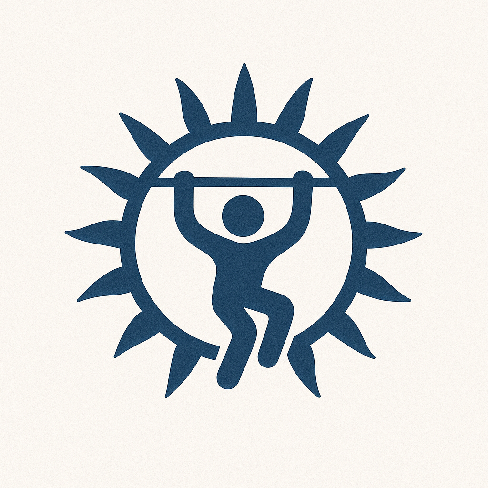
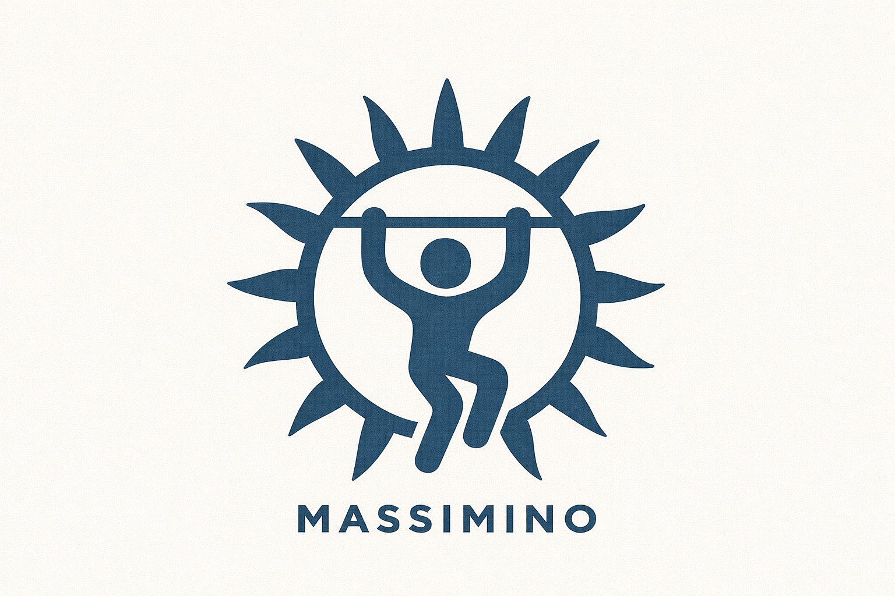

# /design: Massimino visual designer

Use this skill whenever you need a one-off visual tied to a Massimino content piece: an exercise or workout infographic, a training-programme card, a nutrition explainer, a social post visual, a partner announcement, an app-store screenshot frame, or a landing-page section for massimino.fitness. Brand promise to keep in view: **Safe Workouts for Everyone**.

The method (content first, one self-contained scoped section, a central design library) was originally built for Beresol and is adapted here.

## Output contract

**One HTML section, appended to `docs/marketing/designs/index.html`** (Victor screenshots or exports from there). Every design is a self-contained `<section>` with:
- A unique `id` (`design-YYYY-MM-DD-slug`)
- An `<h2 class="design-title">` with date + label (library chrome only, hidden on export)
- All inline CSS scoped by the section id (no external classes); the design must render correctly when isolated for screenshot
- No `<aside class="design-meta">`: source references belong in the chat reply, never on the canvas (hard rule 12)

Git status of that file: `docs/` is **not** gitignored in this repo (`.gitignore` does not list it). Before the first run, ask Victor whether `docs/marketing/designs/` should be added to `.gitignore`; do not add it silently.

## When to use

| Trigger | Canvas | Output |
|---|---|---|
| `/design instagram <topic>` | 1080x1350 (4:5 portrait feed) or 1080x1080 | Feed post visual: one idea, big type, brand stamp |
| `/design story <topic>` | 1080x1920 | Instagram / TikTok story or vertical infographic |
| `/design linkedin <topic>` | 1200x1200 or 1200x627 | LinkedIn square or link-card visual |
| `/design exercise <exercise>` | 1080x1350 | Exercise infographic: target muscles, setup, 3 to 5 cues, common mistakes, safety note |
| `/design workout <topic>` | 1080x1350 or 1080x1920 | Workout card: sets x reps, rest, tempo, progression |
| `/design program <programme>` | 1200x1200 or 1600x900 | Programme card: goal, level, weeks, sessions per week, cover photo |
| `/design nutrition <topic>` | 1080x1350 | Nutrition explainer: macros, portion guide, one clear takeaway |
| `/design partner <partner>` | 1920x1080 slide or 1080x1350 post | Partner announcement: Massimino x partner lockup, what it means for users |
| `/design data <finding>` | 1200x1200 or 1920x1080 | Fitness Intelligence figure (ranking, comparison, choropleth caption card) |
| `/design appstore <screen>` | 1290x2796 (iPhone 6.9"), 1242x2688 (6.5"), 1080x1920 (Google Play) | Store screenshot frame: headline above a device frame holding a real app screenshot |
| `/design hero <topic>` | 1440 wide, responsive | Landing-page section for massimino.fitness |
| `/design quote-card <topic>` | 1080x1350 | Pull-quote from a trainer or athlete (real, attributed, with consent) |
| `/design slide <topic>` | 1920x1080 | 16:9 slide for a partner or investor deck |

If invoked as `/design <free-form description>`, infer the type from context and ask if uncertain.

## Step 1: Read the content the design must accompany

Before generating, ALWAYS:
1. Read the content piece the design supports: the post draft, the programme definition, the exercise entry, the partner brief, the Fitness Intelligence data, the landing copy.
2. Identify the 3 to 5 most visually communicable facts (numbers, names, cues, hierarchies).
3. Decide the layout pattern (see STYLES.md): hero plus stat, bento grid, step list, comparison columns, quote card, device frame.

Refuse to generate if you do not have the source content. Where facts come from:
- **Exercises**: `public/databases/` JSON (and the exercise media in `public/exercises/<slug>/`). Cues and target muscles come from the database entry, not from memory.
- **Programmes**: the programme data in the repo (search `src/` and `public/databases/` for the programme slug) and cover photos in `public/images/programs/`.
- **Market and activity figures**: `src/data/fitness/` (every file header names its source and retrieval date).
- **Partners**: the live `/partnerships` page (`src/app/partnerships/page.tsx`) and the brief Victor supplies.

Fabricated stats, invented user counts, fake testimonials and made-up transformation results are exactly the failure mode to avoid.

## Step 2: Brand kit (canonical, do not invent)

Massimino's tokens are defined in `tailwind.config.js` (`brand.*`) and `src/app/globals.css`, and summarised in `CLAUDE.md`:

```
Fonts
--font-primary:    'Nunito Sans', -apple-system, BlinkMacSystemFont, 'Segoe UI', sans-serif;
                   font-variation-settings: "wdth" 100, "YTLC" 500;
                   (400 body, 700/800/900 display: it is a variable font, 200 to 1000)
--font-secondary:  'Lato', sans-serif;   (captions, labels, small print, eyebrows)

Palette (inline hex)
--primary:         #2b5069   Massimino blue: headings, CTA, logo colour
--primary-light:   #3d6a85   hover, secondary fills, second series
--primary-dark:    #1e3d52   deepest blue: dark bands, text on cream
--cream:           #fcfaf5   warm cream: default background (matches the logo background)
--cream-dark:      #f5f0e8   card tint, section alternation
--ink:             #1e293b   long body text when blue is too heavy
--muted:           #5b6573   captions (passes 4.5:1 on cream)

Semantic (from tailwind.config.js, use sparingly and only for meaning)
--safe:            #10b981   safety.green: safe, correct form, on target
--caution:         #f59e0b   safety.yellow: caution, check with a professional
--risk:            #ef4444   safety.red: common mistake, stop
--muscle:          #e11d48   fitness.muscle: strength
--cardio:          #06b6d4   fitness.cardio
--flexibility:     #8b5cf6   fitness.flexibility: mobility, yoga
--nutrition:       #84cc16   fitness.nutrition

Signature gradients
Primary band:  linear-gradient(135deg, #2b5069 0%, #1e3d52 100%)
Soft band:     linear-gradient(180deg, #fcfaf5 0%, #f5f0e8 100%)
```

For text on white or cream, the semantic 500-weight hues are too light: use them as fills, pills and icon backgrounds, and pair them with dark text (or use the 700 shades: `#047857`, `#b45309`, `#b91c1c`).

Fonts load from Google Fonts (the exact link from `CLAUDE.md`, also used in `src/app/layout.tsx`):
```html
<link rel="preconnect" href="https://fonts.googleapis.com">
<link rel="preconnect" href="https://fonts.gstatic.com" crossorigin>
<link href="https://fonts.googleapis.com/css2?family=Lato:ital,wght@0,100;0,300;0,400;0,700;0,900;1,100;1,300;1,400;1,700;1,900&family=Nunito+Sans:ital,opsz,wght@0,6..12,200..1000;1,6..12,200..1000&display=swap" rel="stylesheet">
```

The central `index.html` already preloads both fonts; still set `font-family: 'Nunito Sans', ...` on the section for screenshot isolation.

### Logos (use exact filenames)

Paths are relative from `docs/marketing/designs/index.html`, so `public/` resolves as `../../../public/...`.

- `massimino_logo_word.png` (1536x1024): the sun-and-lifter mark with the MASSIMINO wordmark underneath. Primary lockup for light backgrounds.
- `massimino_logo.png` (1024x1024): the mark alone. Use for small stamps, avatars and footers.
- `massimino_logo_word_animated.mp4`: animated logo, video-context designs only.
- `icons/icon-512x512.png` etc.: app icons, for app-store frames and "download the app" badges.
- **CRITICAL: both PNG logos are RGB without an alpha channel, on a warm cream background (about `#fcfaf5`).** On cream or white they sit fine as-is (the cream matches the brand background). `filter: brightness(0) invert(1)` will turn the whole rectangle into a solid block and destroy the mark: never use it. For dark bands, use a **cream disc lockup**: `massimino_logo.png` with `border-radius: 50%` on a cream circle, next to a `MASSIMINO` wordmark set in Nunito Sans 800, white, letter-spacing 3px, 22 to 26px:
  ```html
  <div class="design-logo">
    
    <span class="design-logo-word">MASSIMINO</span>
  </div>
  ```
  CSS: wrapper `display: inline-flex; align-items: center; gap: 12px;`; mark `height: 48px; width: 48px; border-radius: 50%; background: #fcfaf5;`; word span Nunito Sans 800, white, letter-spacing 3px.
- **Do not use `public/massimino-logo.svg`.** It is an off-brand placeholder (bright blue `#3B82F6` circle with a generic dumbbell), not the real mark.

### Partner logos (for partner announcements)

All in `public/images/`. Confirm the partnership is live on `/partnerships` (or in Victor's brief) before putting a logo on a canvas.

| Partner | File | Notes |
|---|---|---|
| MU Amsterdam | `muscleupstore.png` | RGBA, 436x228 |
| Quota Vita | `quotavitalogo.jpg` | RGB, 400x400, has its own background: place on a white tile |
| Pump Gymwear | `pumpgymwear.png` | RGBA, 170x148, small: do not upscale beyond about 2x |
| Amix | `amix-logo.png` | |
| Bo | `Bo_logo.png` | |
| Jims | `jims-logo.png` | |

Other logos in `public/images/` (`europe-active-logo.png`, `vitality_logo.png`, `sportcity-logo.jpeg`) are data-source or reference logos, not confirmed partners: do not present them as partners. Lockup pattern: `[Massimino mark] x [partner logo]` at equal optical height, separated by a thin `#2b5069` multiplication sign or a 1px rule.

### Photography

- Programme covers: `public/images/programs/*.jpg` (for example `marathon.jpg`, `musclegain.jpg`, `flexibility.jpg`, `castellers.jpg`).
- Training and equipment backgrounds: `public/images/background/` (`barbell.jpg`, `kettelbells.jpg`, `dumbells_gloves_01.jpg`, `athletism_blue.jpg`, `autumn_run.mp4`) plus city backgrounds (Amsterdam, Barcelona, Paris, London, Brussels and others) used by Fitness Intelligence.
- Exercise demonstrations: `public/exercises/<exercise-slug>/0.jpg`, `1.jpg` (94 exercises).
- Victor's own training photos: `public/victor/*.jpeg`, `public/images/victor.JPG`, `public/images/deadlift.jpg`.
- App screenshots for store frames: capture them fresh from the running app (see Step 4). Never mock up UI that does not exist.

### Hard rules

1. **No emojis.** Ever. Use MDI icons (`<span class="mdi mdi-dumbbell">`, loaded in the central file) or coloured pills.
2. **No double-dashes (`--`) and no em-dashes in visible text.** Use colons, semicolons, full stops or parentheses. En-dashes are fine for numeric ranges ("8–12 reps").
3. **British English.** "colour", "programme" in marketing copy (keep "Program" only where it quotes an in-app label verbatim), "optimise", "centre", "behaviour".
4. **Lowercase after colons.** "Squat: brace before you descend", not "Squat: Brace Before You Descend".
5. **Numerical claims must be sourced.** Every stat traces back to the source content: `src/data/fitness/`, the exercise database, the programme definition, or a figure Victor supplied. No invented user counts, downloads, ratings or results.
6. **Safety and health honesty.** No medical claims, no guaranteed results ("lose 10 kg in 30 days"), no before/after transformations unless real and consented. Exercise visuals show correct form cues and a safety note where the movement carries risk. Nutrition visuals are general guidance, not prescriptions.
7. **Single-CTA discipline.** At most one URL or action. Default CTA is `massimino.fitness`; app-store frames use no URL (the store is the context).
8. **Massimino logo in every design.** Footer or header, sized to the canvas (32 to 56px mark). Use the cream disc lockup on dark bands (never the invert filter).
9. **Date format.** "19 January 2026", never "January 19, 2026" or "19/01/2026" in display text.
10. **Solé with accent.** Whenever Victor's surname appears: "Victor Solé Ferioli".
11. **No dead white space between body and footer.** The footer sits immediately below the body (or the body is vertically centred on a fixed canvas and the footer hugs the bottom). Do not use `min-height: 100vh`, do not stretch the body with `flex: 1` or `justify-content: space-between`. Screenshot and look for an empty band; if there is one, regenerate.
12. **No dates or source metadata on the canvas.** No "reported on", no "Source: ...", no file paths, no dated overline: a date makes the post expire, and source plumbing belongs in the chat reply. An undated credibility line in the body is fine ("Eurostat health survey data").
13. **Every design is exported to PNG or JPG.** The HTML section is the archive; the image is the deliverable. See Step 6 for the export method.
14. **Default aesthetic is light: cream and Massimino blue.** Dark (Primary-Deep) is for hero moments and slides, not the default. Warn before choosing it for a routine post.
15. **Real people only with consent.** Photos of athletes, trainers or partners' staff only if Victor confirms consent. Victor's own photos are fine.

## Step 3: Pexels stock photos (only if needed)

If the design needs an evocative image and no local asset fits (the programme covers and backgrounds above come first), use the Pexels API. The key is `PEXELS_API_KEY` in this repo's gitignored `.env` (read it with `PEXELS_KEY=$(grep '^PEXELS_API_KEY=' .env | cut -d= -f2-)`, never `source` the file), and never write it into a tracked file.

```bash
curl -s -H "Authorization: $PEXELS_KEY" "https://api.pexels.com/v1/search?query=woman+deadlift+gym&per_page=3" \
  | python3 -m json.tool | head -60
```

- Header is `Authorization: <key>` with NO `Bearer` prefix.
- Credit the photographer in the chat reply (and in the post caption if Victor wants), pulling `photographer` + `url` from the response.
- Prefer photos that show safe, correct form; reject ones with obviously poor technique.

## Step 4: Generate the HTML section

Patterns are documented in `STYLES.md` (read when needed). Default aesthetic = **Clean Cream** (Nunito Sans, cream background, Massimino blue accent rule, logo, generous whitespace). Use it most of the time. Alternates: Coach Card, Bento, Primary-Deep, Photo Overlay, Editorial Data, Paper Quote, Bold, Device Frame.

For app-store frames and landing sections, capture real screens from the running app (`npm run dev`, then Chrome at the target device size) and place the PNG inside the Device Frame recipe. Never draw fake UI.

**Template skeleton** (always start here, then specialise):

```html
<section id="design-2026-09-28-squat-cues" class="design design--instagram">
  <h2 class="design-title">28 September 2026: squat cues (Instagram 4:5)</h2>
  <div class="design-canvas">
    <header class="design-header">
      
    </header>
    <div class="design-body">
      <p class="design-eyebrow">Exercise library</p>
      <hr class="design-accent-rule" />
      <h1 class="design-h1">Five cues for a safer back squat.</h1>
      <!-- specialised content here -->
    </div>
    <footer class="design-footer">
      <p class="design-cta">massimino.fitness</p>
    </footer>
  </div>
  <style>
    /* ALL CSS scoped to #design-2026-09-28-squat-cues so designs do not bleed */
    #design-2026-09-28-squat-cues .design-canvas {
      width: 1080px; height: 1350px; background: #fcfaf5; color: #1e3d52;
      font-family: 'Nunito Sans', sans-serif; font-variation-settings: "wdth" 100, "YTLC" 500;
    }
  </style>
</section>
```

Always scope every CSS rule by the section id: many designs share the file.

## Step 5: Append to the central designs file

`docs/marketing/designs/index.html` is a single HTML page with a library header, then each design as one `<section>`, newest at the top. If it does not exist, create it from the boilerplate in `CENTRAL.md`. If it exists, insert the new `<section>` immediately after the `DESIGNS_INSERT_HERE` marker.

## Step 6: Export and report back

Export the `.design-canvas` of the new section to `docs/marketing/designs/<section-id>.png` at 2x. Playwright is installed in this repo's `node_modules`; there is no export script yet (see TODO below), so either:
- write a short one-off Playwright script in the scratchpad that serves the repo root (so `../../../public/...` resolves), waits for `document.fonts.ready`, and screenshots `#<section-id> .design-canvas` with `deviceScaleFactor: 2`; or
- in Chrome DevTools, right-click the canvas node and choose Capture node screenshot.

TODO: port Beresol's `scripts/design/export.mjs` to `scripts/design/export.mjs` in this repo so the command becomes `node scripts/design/export.mjs <section-id> [--jpg]`.

Then output to the user:

```
[OK] /design generated: <design type> for <topic>
File: docs/marketing/designs/index.html
Section id: design-YYYY-MM-DD-<slug>
Open in browser: file:///Users/victorsole/Developer/massimino/docs/marketing/designs/index.html#design-YYYY-MM-DD-<slug>
Exported image: docs/marketing/designs/design-YYYY-MM-DD-<slug>.png
Dimensions: <WxH>
Source content: <path to post draft / exercise entry / programme / data file>
```

## Reusing past designs

If the user says "use the same pattern as last time" or "rerun the programme card for Marathon", read the relevant past `<section>` from `docs/marketing/designs/index.html`, copy the structure, swap the data. Past designs are a template library, not throw-aways.

## Common Massimino design briefs

| Source content | Design type | Default aesthetic |
|---|---|---|
| Exercise tip or form cue post | exercise (4:5) | Coach Card |
| Weekly workout or challenge | workout / story | Clean Cream or Bold |
| Training programme launch (Marathon, Muscle gain, Flexibility, Castellers) | program | Photo Overlay |
| Nutrition explainer (protein per meal, macro split) | nutrition | Bento |
| Fitness Intelligence finding (gym penetration, activity rates) | data / linkedin | Editorial Data |
| Partner news (MU Amsterdam, Quota Vita, Pump Gymwear) | partner | Primary-Deep or Clean Cream |
| Trainer or athlete quote (real, consented) | quote-card | Paper Quote |
| App Store / Google Play listing | appstore | Device Frame |
| massimino.fitness landing section | hero | Clean Cream or Primary-Deep |
| Investor or partner deck | slide | Primary-Deep |

## Read-when-needed references

- `STYLES.md`: named aesthetics, when to pick which, with Massimino CSS recipes
- `CENTRAL.md`: boilerplate for `docs/marketing/designs/index.html` and the append protocol

## Handoff

After /design completes, the calling skill (a social post, `/video`, `/reframe`, a partner brief) should reference the section id and the exported image path in its own output. Never invent the design without the source content.
